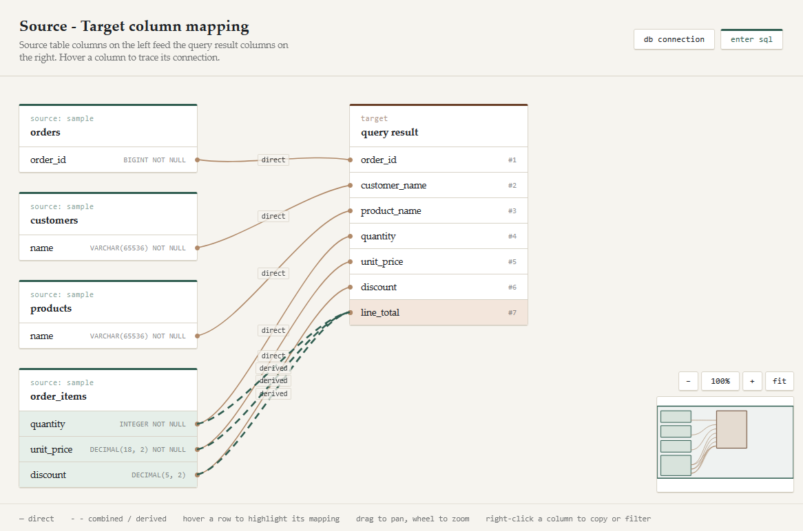
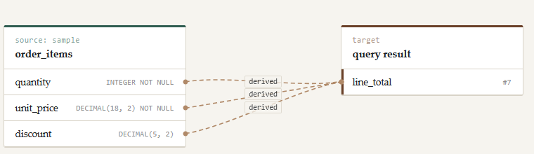

# SQL Analyzer

Analyze relation between tables to answer
- Which columns are they using

## Example run column lineage

**Input**

```sql
select o.order_id
    , c.name as customer_name
    , p.name as product_name
    , oi.quantity
    , oi.unit_price
    , oi.discount
    , (oi.quantity * oi.unit_price * (1 - oi.discount / 100)) as line_total
from order_items oi
join orders o on o.order_id = oi.order_id
join customers c on c.customer_id = o.customer_id
join products p on p.product_id = oi.product_id
```
**Output**

```
order_id                 <- [sample.orders.order_id]
customer_name            <- [sample.customers.name]
product_name             <- [sample.products.name]
quantity                 <- [sample.order_items.quantity]
unit_price               <- [sample.order_items.unit_price]
discount                 <- [sample.order_items.discount]
line_total               <- [sample.order_items.discount (derived), sample.order_items.unit_price (derived), sample.order_items.quantity (derived)]
```

**Output graph**



**Filter only interested output column**


